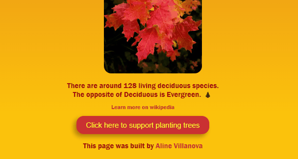

<h1 align="center"> Deciduous Trees 🍁 </h1>

## Sobre o projeto:
Esta foi a [primeira LandingPage criada por mim](https://www.shecodes.io/workshops/shecodes-basics-4f5562dc-43ea-454e-91d8-11776fe3d6d0/projects/544001%20target=%22_blank%22) A escolha do tema veio da paixão que tenho por árvores, principalmente pelas que mudam de cor e as folhas caem no outono. 🍂
Para este projeto utilizei conhecimentos de HTML, CSS e JavaScript que aprendi no Workshop 
[SheCodes Basics](https://www.shecodes.io/workshops) em Outubro de 2021.
Um dos maiores desafios foi colocar as imagens na posião desejada. Porém, na época, eu não conhecia os conceitos de Flexbox, nem Grid. 🤯 
Então, o projeto ficou bem simples, porém, bem verdadeiro. 🤍

## Project:
This was [my very first LandingPage built by me.](https://www.shecodes.io/workshops/shecodes-basics-4f5562dc-43ea-454e-91d8-11776fe3d6d0/projects/544001%20target=%22_blank%22) The theme was chosen based on my love for trees. Especially deciduous ones, that is, the trees whose leaves fall in autumn. 🍂
In order to build this LandingPage, I used HTML, CSS and some JavaScript, skills that I learned by taking the [SheCodes Basics](https://www.shecodes.io/workshops) workshop in October 2021.
One of the challenging moments for me was to place the images the way I wanted. It wasn't possible because at that time I didn't have any FlexBox or Grid knowledge yet. 🤯
So, the LandingPage ended up as a very simple, but true one. 🤍
 
## Tecnologias Utilizadas:
  - HTML
  - CSS
  - JavaScript
 

 

 

## Thanks for reading :)
### [Aline Delavy Villanova](https://www.linkedin.com/in/aline-delavy-villanova-578085109/)
 

